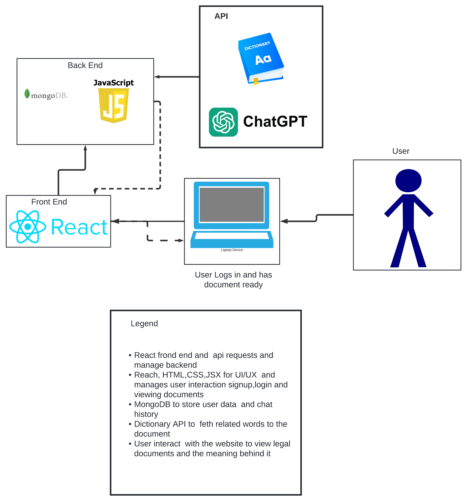

# System Block Diagram
This system block diagram illustrates the flow and interaction between different components of the TOS dumbifier
Users interact with the frontend (built with React) to log in, view the document, and look up words in the dictionary. 
The frontend communicates with the backend JSX and Mongo DB for data processing and uses ChatGPT to process the document
into a readible document
